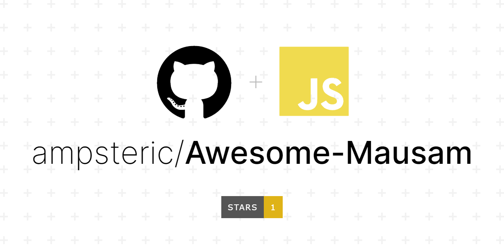

<h1 align="center"><b> TEAM AWESOME MAUSAM </b></h1>
<p align="center">
    <a href="" target="_blank">
        
    </a>
</p>

## PROBLEM STATEMENT:

This project was created and developed with the motive to make it as simple as possible especially for the people who are not familiar with advanced tech. Keeping all the things in mind a simple weather app should have, we have included all the necessary features required to check the weather of a particular location as well as geo-locating oneself and checking out their location's weather.

## HOW TO GET STARTED?

- Open the CMD in windows.
- Change the current working directory to the location where you want the cloned directory.
- Type git clone, and then paste the URL you copied earlier.

```sh
git clone [URL]
```

- Now run `npm install` to install all the node packages.

```sh
npm install
```

- And then run `npm start` to start the web-UI in development mode. 

```sh
npm start
```
- Open ***http://localhost:3000*** to view it in the browser.
```sh
port:3000
```
## LANGUAGES AND FRAMEWORKS USED:

 <div>
 
 
 
 
 
 
 </div>
 
 ## PREVIEW:
 
 
 
 

## CONTRIBUTIONS:

When contributing to this repository, please discuss the change you want to make via issue, email or any other method with the owners of this repository before making the change.

## Found a Bug? Missing a specific feature?
Feel free to file a new issue with a respective title and description on the repository. If you already found a solution to your problem, we would love to review your pull request! Have a look at our contribution guidelines to find out about our coding standards.

<div align="center">
    <p text align="center" color="blue">✨ All Contributors ✨</p>
 </div>

</br>

<table>
  <tr>
      <td align="center"><a href="https://github.com/ampsteric"><br /><sub><b>SHASHWAT MISHRA</b></sub></a><br />
<p align="center">
   
   <a href="https://www.linkedin.com/in/shashwat-mishra-699bab194/" alt="Linkedin"></a>
    <a href="mailto:ampsteric@gmail.com" alt="Contact me"></a>
    </p>
</td>
      
   <td align="center"><a href="https://github.com/AruneshS"><br /><sub><b>ARUNESH SARMAH</b></sub></a><br />
    <p align="center">
   
   <a href="https://www.linkedin.com/in/arunesh-sarma-79b57aab" alt="Linkedin"></a>
    <a href="mailto:arutuhin@gmail.com" alt="Contact me"></a>
    </p>

</td>
   
   <td align="center"><a href="https://github.com/ujjwal63"><br /><sub><b>UJJWAL GUPTA</b></sub></a><br />
<p align="center">
    
   <a href="https://www.linkedin.com/in/gupta--ujjwal/" alt="Linkedin"></a>
    <a href="mailto:ujjwalgupta0611@gmail.com" alt="Contact me"></a>
  </p>
      </td>
    </tr>
    </table>

